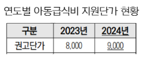
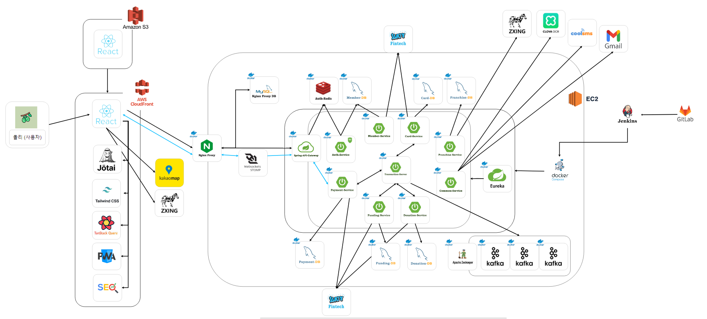
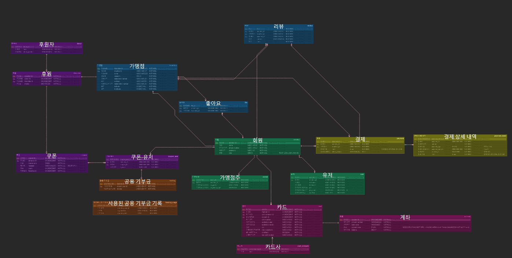
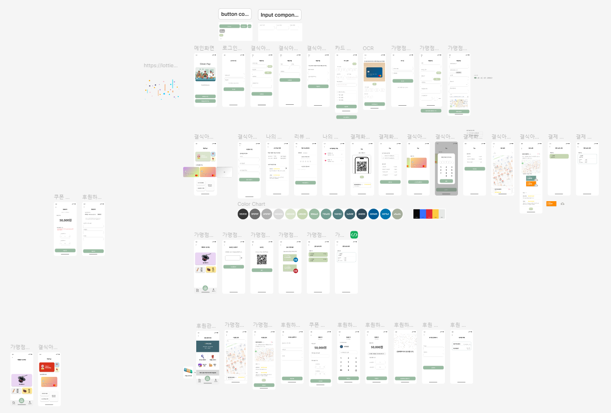
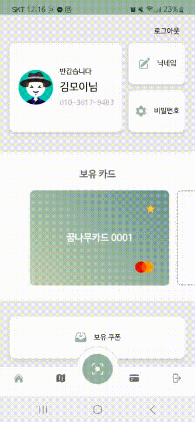
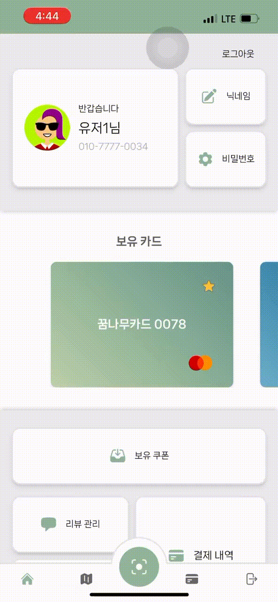
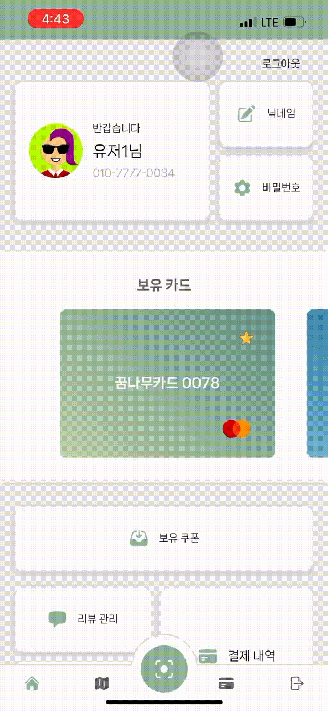
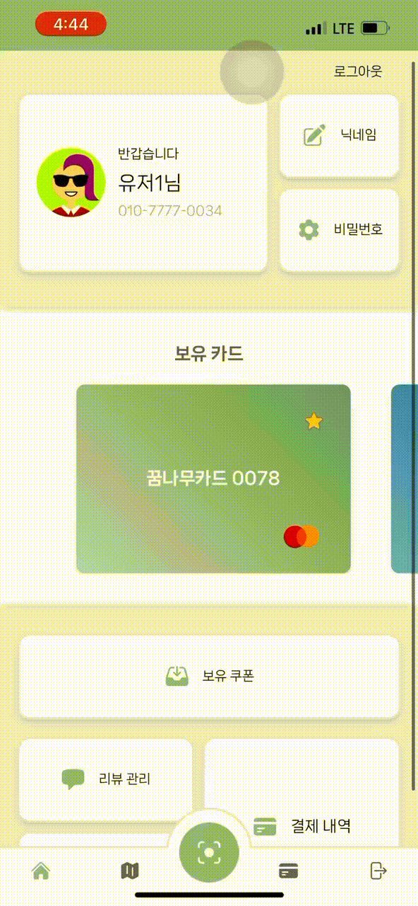
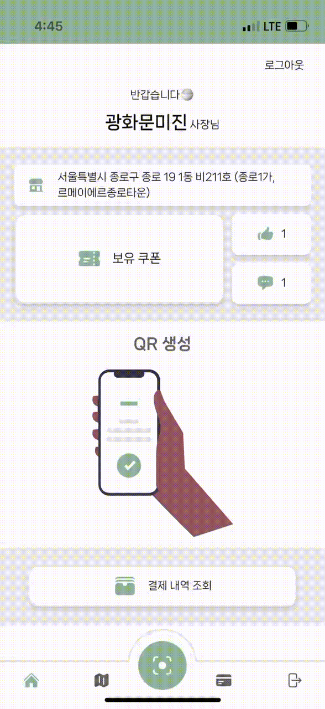

# OlivePay 프로젝트

- 개발 기간 : 2024.08.26~2024.10.11 (약 7주)
- 배포 주소 : https://olivepay.co.kr/

[올리브 페이(Olive Pay)](http://olivepay.co.kr)

---

## 🎀 프로젝트 개요

**OlivePay**는 급식 결여 아동을 위한 꿈나무카드를 사용하여 가맹점에서 식사를 할 수 있도록 지원하는 서비스입니다. 급식 결여 아동은 꿈나무카드와 쿠폰, 차액 결제 카드를 통해 간편하게 결제하고, 후원자들은 기부를 통해 쿠폰을 만들 수 있으며 이를 통해 아동들에게 다양한 메뉴 선택지를 제공할 수 있습니다. 이 프로젝트는 사용자의 심리적 장벽을 완화하고, 기부를 통해 다양한 메뉴를 제공하여 급식 결여 아동의 급식 환경을 개선하는 데 목적이 있습니다.

---

## 🎉 프로젝트 배경

### 첫번째 문제, 부족한 지원금

**전국 일반 식당 평균 점심 식대결제금액은 1만96원**인 것으로 집계되었습니다.
이는 제공되는 아동 급식비 지원금과의 차이가 있음.

- 2023년 아동 급식비 지원금은 8,000원이었으며, 2024년에는 9,000원으로 인상되었지만 여전히 평균 식대에 미치지 못하는 실정.  
  

### 두번째 문제, 불편한 가맹점 검색

- 급식 결여 아동이 이용할 수 있는 가맹점의 정보가 부족하고,
  검색 시스템이 불편하여 사용자가 접근하기 어려움
- 사용자는 가까운 가맹점을 쉽게 찾기 어려워 효율적인 카드 사용에 제약

### 세번째 문제, 아이들의 심리적 장벽

- 급식 결여 아동들은 꿈나무 카드를 통해 결제하는 것에 대한 심리적 장벽이 존재

### 네번째 문제, 데이터 비일관성

- 기존 데이터 관리 시스템의 문제로 인해 가맹점 정보가 정확하지 않은 데이터 다수 존재
- 이는 급식 결여 아동이 가맹점에서 원활한 서비스를 제공받기 어렵게 만드는 요소

---

## 🎁 목적 & 해결방안

- **부족한 지원금 해결**
  - **기부를 통한 쿠폰 발급**: 후원자들이 가맹점에 기부하여 추가적인 식사 비용을 해결할 수 있도록 합니다. 기부금은 결식 아동들에게 **2,000원 / 4,000원** 단위의 쿠폰으로 제공되어, 부족한 급식비 지원금을 보완합니다.
- **불편한 가맹점 검색 해결**
  - **가맹점 지도 제공**: 결식 아동이 가까운 가맹점을 쉽게 찾을 수 있도록 **가맹점 지도 기능**을 제공하여, 위치 기반으로 가맹점을 검색할 수 있습니다.
  - **사용자 친화적인 인터페이스**: 직관적인 지도 인터페이스를 통해 결식 아동이 **가장 가까운 가맹점**을 쉽게 찾고 사용할 수 있게 합니다.
- **아이들의 심리적 장벽 완화**
  - **서비스를 통한 결제** : 결식 아동들이 실물 꿈나무 카드를 직접 사용하지 않아
    결제 과정에서 느낄 수 있는 심리적 부담을 줄입니다.
- **데이터 비일관성 해결**
  - **데이터 관리 시스템 개선**: 정확한 가맹점 정보를 제공하고, 정기적으로 데이터베이스를 업데이트하여 사용자들에게 최신 가맹점 정보를 제공합니다.

💫 급식 결여 아동들이 더 편하고 거부감없이 꿈나무카드를 사용할 수 있게 하며, 쿠폰을 통한 메뉴 선택에 다양성을 제공 및 가맹점을 쉽게 조회할 수 있도록 도와줍니다.

---

## 🎯 타겟

- **급식 결여 아동**: 꿈나무카드를 통해 결식을 해결하려는 아동들이 주 타겟입니다.
  이 서비스는 아동들이 심리적 부담 없이 카드를 이용할 수 있도록 돕고,
  쿠폰을 통해 더 다양한 메뉴 선택의 기회를 제공합니다.
- **가맹점주**: 가맹점주들은 아이들이 보다 간편하게 결제할 수 있도록 도와주며,
  꿈나무 카드 사용을 꺼려하는 아이들의 심리적 장벽을 줄여줄 수 있습니다.
- **후원자**: 후원자는 가맹점에 기부하여 급식 결여 아동이 음식을 선택할 수 있는 쿠폰을 발급할 수 있습니다. 후원자는 계좌 이체를 통해 기부를 간편하게 진행할 수 있습니다.

---

## ✨ 주요 기능

### 1. QR **결제 기능**

- 급식 결여 아동은 꿈나무카드와 쿠폰을 사용하여 음식을 결제할 수 있으며,
  초과 금액은 등록한 차액 결제 카드로 결제 가능합니다.
- QR 결제를 통해 간편하게 결제할 수 있으며, 타 페이 시스템을 사용하는 것과 같은 동작을 통해 결제가 이루어지기 때문에 아이들의 심리적 장벽을 줄여줄 수 있습니다.

### 2. **가맹점 지도 제공**

- 사용자는 지도에서 꿈나무카드 가맹 음식점을 쉽게 검색할 수 있습니다.
- 급식 결여 아동은 쿠폰 발급이 가능한 가맹점을 지도에서 확인하고 음식을 결제할 수 있습니다.

### 3. **기부 및 쿠폰 생성**

- 후원자는 지정 가맹점에 기부할 수 있으며,
  기부금은 급식 결여 아동을 위한 쿠폰으로 전환됩니다.
- 쿠폰은 2,000원, 4,000원 단위로 발급되며, 후원자가 원하는 대로 선택할 수 있습니다.

### 4. **쿠폰 관리**

- 급식 결여 아동은 하루 최대 2개의 쿠폰을 저장할 수 있으며,
  이 쿠폰을 가맹점에서 사용하여 식사를 결제할 수 있습니다.

### 5. **후원 내역 확인**

- 후원자는 이메일을 통해 기부 현황을 확인할 수 있으며,
  후원금 사용 내역이 주기적으로 Email로 발송됩니다.

---

## 🎨 기술적 차별점

## 1. 긴 트랜잭션 관리 및 SAGA 패턴 적용

OlivePay 서비스는 여러 마이크로서비스가 연결된 긴 트랜잭션을 처리합니다.
특히, **SAGA 패턴**을 도입하여 트랜잭션을 여러 단계로 나누어 처리함으로써
각 서비스 간의 결합도를 낮추고 **전체 트랜잭션의 일관성**을 유지합니다.

- **이점**: 하나의 서비스에서 오류가 발생하더라도, 전체 시스템이 영향을 받지 않도록 하고,
  필요한 경우 **롤백 처리**를 통해 시스템의 일관성을 보장합니다.
- **적용 기술**: Kafka를 통한 이벤트 기반 통신을 활용하여 비동기 처리를 가능하게 하고,
  시스템의 유연성을 극대화합니다. 또한, 카프카 브로커 3개를 사용하며 ReplicaFactor를 2로 설정하여 메시지 유실을 최소화 하며 이를 통해 시스템 안정성을 높혔습니다.

---

## 2. 쿠폰 다운로드의 동시성 처리

OlivePay는 쿠폰 다운로드 시 **동시성 문제**를 해결하기 위해
**버전 관리 및 쿠폰 수량 관리** 시스템을 도입했습니다.

- **버전 확인**: 요청 시점의 데이터베이스에 저장된 쿠폰의 버전 정보를 비교하여
  다른 사용자가 동시에 쿠폰을 다운로드하는 것을 방지합니다.
- **수량 확인**: 버전이 일치할 경우 쿠폰 수량을 확인하고, 수량이 충분하면 쿠폰을 발급합니다.
  - 이를 통해 동시성 문제를 해결하고,
    쿠폰 다운로드 시 발생할 수 있는 트랜잭션 실패를 방지합니다.

---

## 3. 비동기 처리

문자 메시지, 이메일 전송과 같은 작업에서 비동기 처리를 도입하여 응답 속도를 향상시켰습니다.

- **비동기 작업 적용**: @Async 어노테이션을 사용하여 **백그라운드 스레드**에서 메시지 전송 작업을 처리합니다. 이는 동기적 처리에서 발생할 수 있는 대기 시간을 줄이고, 사용자가 요청에 대한 응답을 더 빠르게 받을 수 있게 합니다.
- **효과**: 대규모의 문자 메시지 전송 작업이 있어도, 사용자 경험을 저해하지 않고 빠른 응답을 제공할 수 있습니다.

---

## 4. 조회 성능 최적화

후원자가 가맹점을 검색할 때, 빠르게 가맹점을 조회할 수 있도록 **조회 성능을 최적화**했습니다.

- **적용 기술**: **MBRContains**와 같은 공간 인덱싱 기법을 도입하여 지도 상에서의 가맹점 조회 속도를 대폭 개선했습니다.
- **효과**: 약 70%의 조회 성능 개선을 통해 후원자가 원하는 가맹점을 빠르게 찾을 수 있게 하였으며, 이는 결식 아동이 적시에 음식을 받을 수 있도록 돕습니다.

---

## 5. Role에 따른 사용 가능한 기능 분리

OlivePay 서비스는 **MSA**를 사용하여, 각 역할에 따른 서비스 **접근 권한**을 세분화할 필요가 있습니다.

**후원자**, **가맹점주**, **유저**라는 Role을 분리하고 각 역할에 따라 사용 가능한 기능을 세분화하여 서비스에 적용했습니다. 이를 통해 각 사용자가 **권한**에 맞는 기능만 **접근**할 수 있도록 하여 보안을 강화했습니다.

- **적용 기술**: Toss의 Passport 구조를 참고해 회원ID와 Role을 트랜잭션 내로 전파하는 방법을 사용했습니다. OlivePay에서 유저 식별키와 함께 API를 요청하게 되면 Gateway에서 Custom Header를 통해 각 서비스에 전파합니다.
- **효과**: 각 서비스 내부에서 사용되는 API에 대한 권한을 제어할 수 있습니다. Gateway를 통하지 않는 접근을 제어함으로써 보안을 강화할 수 있었습니다.

---

💫 이와 같은 기술적 차별점을 통해 **OlivePay**는 안정적이고 빠른 서비스를 제공하며, 결식 아동을 지원하는 데 있어 시스템의 효율성을 높였습니다.

---

## 🎓 팀원

| 역할     | 이름   | 담당                             |
| -------- | ------ | -------------------------------- |
| Frontend | 김일태 | - 유저, 가맹점 정보 조회 및 수정 |

- 가맹점 조회 및 검색, 찜 등록, 리뷰
- QR 기반 결제 및 결제 내역 관리
- 라우팅 설정 및 커스텀
- PWA / SEO |
  | Frontend | 이소희 | - 회원가입/로그인, 카드 등록 페이지
- 후원 관련 페이지 |
  | Backend | 김준영 | - Gateway 기반 인증/인가
- 프론트 S3 (CDN) 배포 |
  | Backend | 김진이 | - 결제 관련 서비스 개발
- 가맹점 관련 서비스 개발
- 기부 관련 서비스 개발 |
  | Backend | 서정희 | - 젠킨스 기반 빌드/배포 자동화
- 후원 관련 서비스 개발 |
  | Backend | 왕승철 | - 분산 환경에서의 트랜잭션 관리
- 카드/계좌 관련 서비스 개발 |

---

## 📙 설계 문서

## MSA 아키텍처

## ERD

## 

## Figma

---

## 🎞 시연

### 👦🏻 사용자 (급식 결여 아동 기능) + 가맹점주 QR 생성

1. `회원가입 & 로그인 (꿈나무 카드 등록)`

   

---

2. `사용자 카드 등록 (OCR)`

   

---

3. `사용자 지도 검색 (가맹점 찜)`

   

---

4. `사용자 쿠폰 획득` (최대 2개 획득 가능)

   

---

5. `사용자 내 쿠폰 조회`

   

---

6. `1) 가맹점주 결제 QR 생성`

   

---

7. `2) 사용자 QR 결제`

   

---

7. `사용자 결제 내역 조회`

   

---

8. `사용자 리뷰 등록`

   

---

### 🥘 가맹점주 기능

1. `가맹점주 결제 QR 생성`

   

---

2. `가맹점주 내 가게 결제 내역 확인`

   

---

3. `가맹점주 내 가게 보유 쿠폰 확인`

   

---

### 💌 후원자

1. `후원자 후원`

   

---

2. `후원자 후원 내역 조회`

   

---
